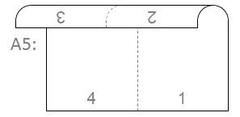
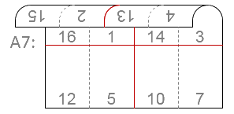
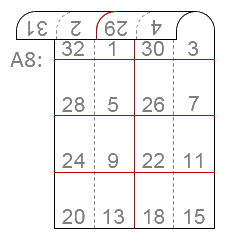
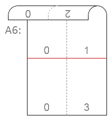
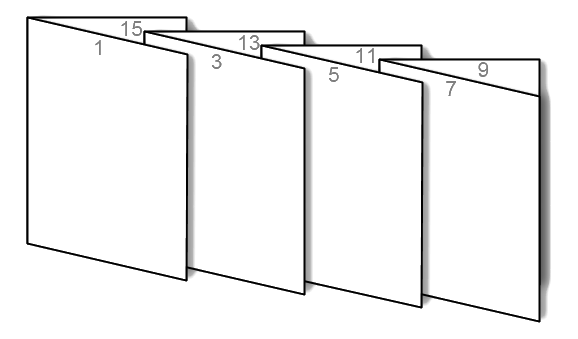
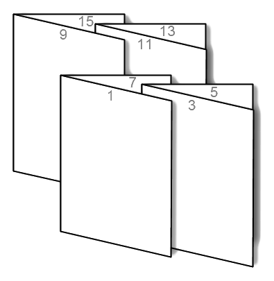
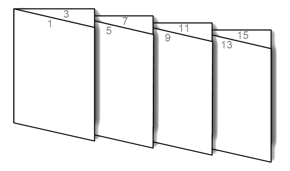

# 📚 Booklet Print Order 🖨️

Script for counting booklet printing page ordering. Allows you to make dual-sided booklets in various formats, with basic A4 paper.

## Installation

`pip install -r requirements.txt`

## Usage

`Booklet.py [-p PARTS] [-e EMPTY] [-m] [-n] [-h] pages {A4,A5,A6,A7,A8}`

- <u>**Positional Arguments:**</u>
	- **pages** Number of pages in book.
	- **{A4,A5,A6,A7,A8}** Booklet format and size.

- <u>**Optional Arguments:**</u>
	- **-p PARTS, --parts PARTS** Divide bookbind pages on equal parts. 
	<u>WARNING</u>: Output may contain empty pages! 
	(default = 1)
	- **-e EMPTY_PAGE, --empty_page EMPTY_PAGE** Page number, which will be printed instead of blank pages in the end of booklet. 
	<u>WARNING</u>: 0 value may be throwed while printing! 
	(default = 1)
	- **-m, --ms_office_fix** Slice output to avoid limitation in MS Office products (255 chars). 
	(default = false)
	- **-n, --no_buffer** Do not copy output to buffer. 
	(default = false)
	- **-h, --help** Show this help message and exit. 
	(default = false)

## Examples

### A5 booklet:

`Booklet 4 A5`

Output: 
**4,1,2,3**

------

### A6 booklet:

`Booklet 8 A6`

Output: 
**8,1,6,3,2,7,4,5**

------

### A7 booklet:

`Booklet 16 A7`

Output: 
**16,1,14,3,12,5,10,7,4,13,2,15,8,9,6,11**

------

### A8 booklet:

`Booklet 32 A8`

Output: 
**32,1,30,3,28,5,26,7,24,9,22,11,20,13,18,15,4,29,2,31,8,25,6,27,12,21,10,23,16,17,14,19**

------

### Booklet with blank pages:

`Booklet 5 A6 -e 0`

Output: 
**0,1,0,3,2,0,4,5**

------

### Simple booklet:

`Booklet 16 A5`

Output: 
**16,1,2,15,14,3,4,13,12,5,6,11,10,7,8,9**

------

### Booklet splited into 2 parts:

`Booklet 16 A5 -p 2`

Output: 
**8,1,2,7,6,3,4,5** 
**16,9,10,15,14,11,12,13**

------

### Booklet splited into 4 parts:

`Booklet 16 A5 -p 4`

Output: 
**4,1,2,3** 
**8,5,6,7** 
**12,9,10,11** 
**16,13,14,15**

------

### Booklet with MS Office fix:

`Booklet 100 A5 -m`

Output: 
**100,1,2,99,98,3,4,97,96,5,6,95,94,7,8,93,92,9,10,91,90,11,12,89,88,13,14,87,86,15,16,85,84,17,18,83,82,19,20,81,80,21,22,79,78,23,24,77,76,25,26,75,74,27,28,73,72,29,30,71,70,31,32,69,68,33,34,67,66,35,36,65,64,37,38,63,62,39,40,61,60,41,42,59,58,43,44,57**
 
**56,45,46,55,54,47,48,53,52,49,50,51**

------
